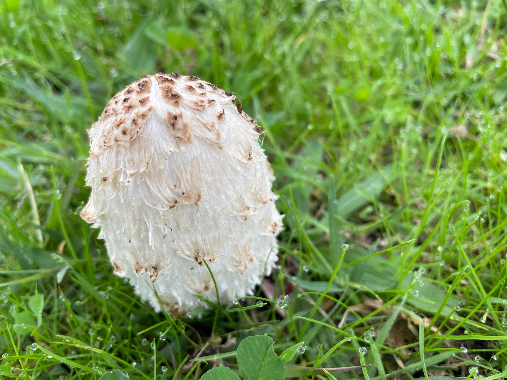

## Faster Pussycat Productions – a small but tenacious graphic design business.

Born on the 5th July 1994, we draw upon our decades of experience in advertising and marketing to make your projects purr.

## Ready to pounce…

Our lean size and depth of experience allows us to spring into action and tackle any deadline. Advertising, stationery, CD/DVD art, logos, website design and development, digital ads, graphics for TV and film, print management, project co-ordination... whatever your requirements are.

## …and always on the prowl.

We take pride in completing jobs on time and within budget. This makes for happy clients and, for us, that's the best advertisement. With an impressive client base and with a wide range of projects completed since 1994, Faster Pussycat Productions is the perfect partner for your business. We always go beyond the call of duty when it comes to providing extra value — it has become second nature to us.

If your previous experiences have left you feeling cold, choose Faster Pussycat Productions. From concept to implementation, we will make your project purr.